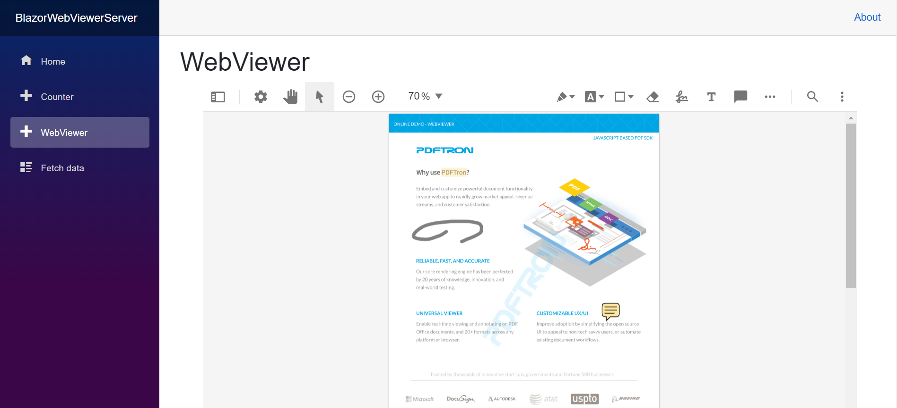

# WebViewer - Blazor Sample
WebViewer is a powerful JavaScript-based PDF Library that's part of the PDFTron PDF SDK. It provides a slick out-of-the-box responsive UI that interacts with the core library to view, annotate and manipulate PDFs that can be embedded into any web project.

## Run the sample

Make sure [.NET SDK 3](https://dotnet.microsoft.com/download/dotnet-core/3.0) is installed and execute `dotnet run` in the project directory. 
WebViewer can be found at https://localhost:5001/WebViewer:

